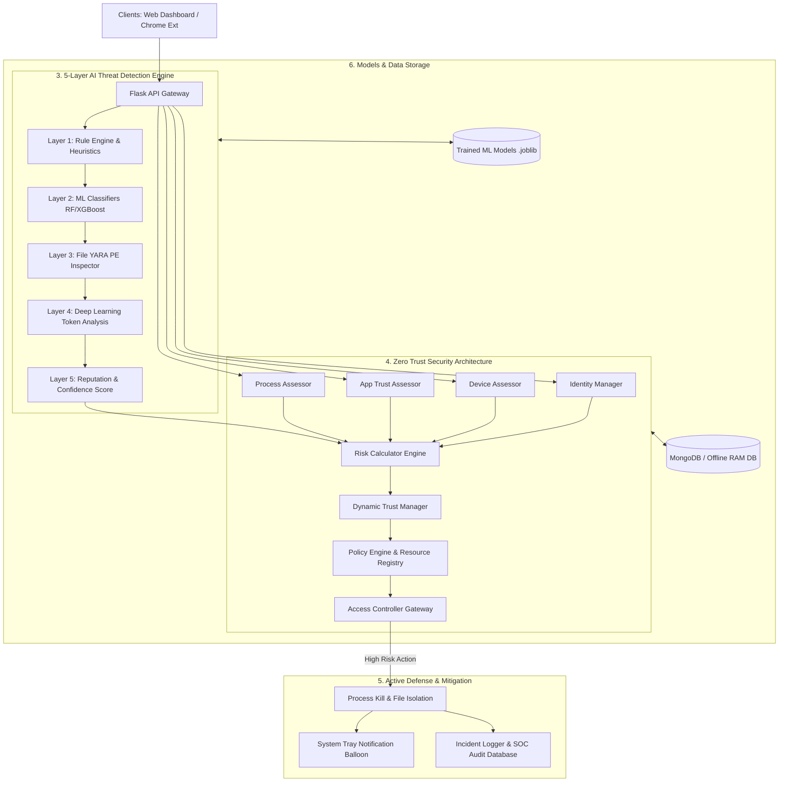
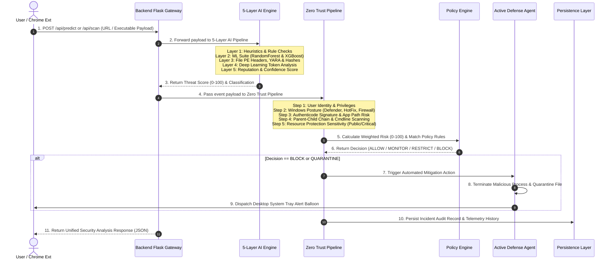

# ABTD — Adaptive Behavioral Threat Detection
### AI-Powered Zero Trust Endpoint Protection Platform v2.0

> Final Year Engineering Project | Python 3.11 | Flask | MongoDB Atlas | scikit-learn | Zero Trust Architecture

---

## 🛡️ What is ABTD?

ABTD is a comprehensive **Windows endpoint security platform** built on two integrated layers:

| Layer | Description |
|-------|-------------|
| **v1.0 — Detection Engine** | 5-layer ML + heuristic threat scoring for URLs, files, and processes |
| **v2.0 — Zero Trust Architecture** | Never-trust-always-verify continuous verification pipeline with behavioral correlation |

Together they form a **detect → evaluate → decide → respond** loop that runs on every security event.

---

## 🏗️ System Architecture v2.0

### 📐 High-Level Architectural Block Diagram

```
+---------------------------------------------------------------------------------------------------+
|                                1. CLIENT & PRESENTATION LAYER                                     |
|  +---------------------------+   +----------------------------+   +----------------------------+  |
|  | Enterprise Web Dashboard  |   | Chrome Browser Extension   |   | Desktop Notification Alert |  |
|  | (HTML5 / Glass CSS / JS)  |   | (Manifest V3 Background)   |   | (Plyer System Tray)        |  |
|  +-------------+-------------+   +--------------+-------------+   +--------------+-------------+  |
+----------------|--------------------------------|--------------------------------|----------------+
                 |                                |                                |
                 v                                v                                v
+---------------------------------------------------------------------------------------------------+
|                                2. BACKEND API GATEWAY (Flask)                                     |
|   /dashboard | /scanner | /api/predict | /api/scan | /api/zero-trust/* | /api/stats | /api/status   |
+------------------------------------------------+--------------------------------------------------+
                                                 |
                       +-------------------------+-------------------------+
                       |                                                   |
                       v                                                   v
+---------------------------------------------+   +-------------------------------------------------+
|   3. 5-LAYER AI THREAT DETECTION ENGINE     |   |       4. ZERO TRUST SECURITY ARCHITECTURE       |
| +-----------------------------------------+ |   | +-----------------------+ +-------------------+ |
| | Layer 1: Rule Engine & Heuristics       | |   | | Identity Manager      | | Device Assessor   | |
| +--------------------+--------------------+ |   | | (Windows SID / Priv)  | | (Defender/Patch)| |
|                      |                      |   | +-----------+-----------+ +---------+---------+ |
|                      v                      |   |             |                     |           |
| +-----------------------------------------+ |   |             v                     v           |
| | Layer 2: ML Classifiers (RF / XGBoost)  | |   | +-------------------------------------------+ |
| +--------------------+--------------------+ |   | | App Trust Assessor | Process Assessor     | |
|                      |                      |   | +-----------+-------------------+-----------+ |
|                      v                      |   |             |                   |             |
| +-----------------------------------------+ |   |             +---------+---------+             |
| | Layer 3: File & YARA PE Inspector       | |   |                       |                       |
| +--------------------+--------------------+ |   |                       v                       |
|                      |                      |   | +-------------------------------------------+ |
|                      v                      |   | | Risk Calculator (Weighted Score 0-100)    | |
| +-----------------------------------------+ |   | +---------------------+---------------------+ |
| | Layer 4: Deep Learning Token Analysis   | |   |                       |                       |
| +--------------------+--------------------+ |   |                       v                       |
|                      |                      |   | +-------------------------------------------+ |
|                      v                      |   | | Dynamic Trust Manager (State & Decay)     | |
| +-----------------------------------------+ |   | +---------------------+---------------------+ |
| | Layer 5: Reputation & Confidence Score  | |   |                       |                       |
| +--------------------+--------------------+ |   |                       v                       |
|                      |                      |   | +-------------------------------------------+ |
|                      +----------------------+-->| | Policy Engine & Access Controller Gateway | |
|                                             |   | | (ALLOW / MONITOR / RESTRICT / BLOCK)      | |
|                                             |   | +---------------------+---------------------+ |
+---------------------------------------------+   +-----------------------|-------------------------+
                                                                          |
                                                                          v
+---------------------------------------------------------------------------------------------------+
|                               5. ACTIVE DEFENSE & MITIGATION TIER                                 |
|  +-----------------------------------+  +---------------------------------+  +------------------+ |
|  | Process Monitor & Network Sniffer |  | Quarantine Manager (Kill/Isolate) |  | Incident Logger  | |
|  +-----------------------------------+  +---------------------------------+  +------------------+ |
+---------------------------------------------------------------------------------------------------+
                                                 |
                                                 v
+---------------------------------------------------------------------------------------------------+
|                                6. DATA PERSISTENCE & MODELS TIER                                  |
|  +------------------+   +-------------------+   +-------------------------+   +-----------------+ |
|  | config.py        |   | models/*.joblib   |   | MongoDB / Offline RAM   |   | awareness/*.json| |
|  +------------------+   +-------------------+   +-------------------------+   +-----------------+ |
+---------------------------------------------------------------------------------------------------+
```

---

### 📊 System Flowchart Diagram (Mermaid)



---

### 🔄 End-to-End Execution & Request Data Flow



#### 📋 Step-by-Step Execution Lifecycle

1. **Ingestion**: Requests originate from the **Chrome Extension** (intercepting web traffic) or the **Enterprise Dashboard** (manual scanning).
2. **AI Analysis Pipeline**: The payload is evaluated sequentially through all 5 layers of the AI engine to generate an ensemble Threat Score (0–100).
3. **Zero Trust Signal Gathering**: The **Identity Manager**, **Device Assessor**, **App Trust Assessor**, and **Process Assessor** continuously gather real-time security posture indicators from the OS.
4. **Risk Aggregation**: The **Risk Calculator** applies normalized weights to produce the final Zero Trust Risk Score (0–100).
5. **Policy Decision & Routing**: The **Policy Engine** evaluates active rules against the risk score and resource sensitivity to dictate the decision (`ALLOW`, `MONITOR`, `RESTRICT`, `BLOCK`, `QUARANTINE`).
6. **Active Defense & Mitigation**: If high risk is detected, the **Quarantine Manager** isolates the file or kills the process, notifying the user via desktop balloon tips and updating the SOC Incident Log.

---

## 📦 Datasets Used

| Dataset | Size | Used For |
|---|---|---|
| `Phishing_Legitimate_full.csv` | 10K rows, 48 features | URL classifier (pre-extracted features) |
| `balanced_urls.csv` | 632K raw URLs | URL classifier (feature extraction) |
| `Malware dataset.csv` | 100K rows | Malware process classifier |
| `Obfuscated-MalMem2022.csv` | 58K rows (Volatility) | Memory anomaly detection |
| `Midterm_53_group.csv` | 394K packets (Wireshark) | Network behavior anomaly |

## 🤖 ML Models

| Model | Algorithm | Input | Output |
|---|---|---|---|
| `url_classifier.pkl` | Random Forest (300 trees) | 17 URL structural features | Benign / Phishing |
| `malware_classifier.pkl` | Random Forest (200 trees) | Process memory features | Benign / Malware |
| `memory_anomaly.pkl` | Isolation Forest | Volatility memory dump features | Normal / Anomaly |
| `behavior_anomaly.pkl` | Isolation Forest | Per-IP network packet stats | Normal / Anomaly |

---

## 🚀 Quick Start

### 1. Install Dependencies
```bash
pip install -r requirements.txt
```

### 2. Configure Environment
```powershell
# Edit .env with your keys
MONGO_URI=mongodb+srv://...
GEMINI_API_KEY=...
SIMULATION_MODE=true     # Safe mode: destructive ZT actions are dry-run only
```

### 3. Generate Extension Icons
```powershell
python generate_icons.py
```

### 4. Train ML Models
```powershell
# Train all 4 models (10–30 min first time)
python train_all.py

# Or train individually
python train_all.py --url-only
python train_all.py --skip-url
```

### 5. Start the System
```powershell
# Full system (Flask + Windows Agent v2.0 — 6 monitoring threads)
python run.py

# Flask only (no background monitoring)
python run.py --no-agent

# Open: http://127.0.0.1:5000/dashboard
# Zero Trust: http://127.0.0.1:5000/zero-trust
```

### 6. Load Chrome Extension
1. Open Chrome → `chrome://extensions`
2. Enable **Developer Mode** (top-right toggle)
3. Click **Load unpacked**
4. Select `d:\Cyber-Thread-Detection\extension\`

### 7. Run Tests
```powershell
# All tests (includes Zero Trust, Correlation, Assessment)
python -m pytest tests/ -v

# Specific suites
python -m pytest tests/test_zero_trust.py -v   # ZT pipeline (30+ tests)
python -m pytest tests/test_correlation.py -v  # Behavior & Correlation
python -m pytest tests/test_assessment.py -v   # Security Assessment
```

---

## 📁 Project Structure

```
Cyber-Thread-Detection/
├── config.py                  ← Central config (ZT thresholds, collections, weights)
├── run.py                     ← Main entry point
├── train_all.py               ← ML training orchestrator
│
├── zero_trust/                ← Zero Trust Architecture (v2.0)
│   ├── identity/              ← Windows identity & privilege tracking
│   ├── device_trust/          ← Firewall, Defender, patches, Secure Boot
│   ├── application_trust/     ← Authenticode signature, publisher, path risk
│   ├── process_trust/         ← Masquerading, parent-child chains, cmdline
│   ├── resource_protection/   ← 30+ sensitive resources, sensitivity-based ACL
│   ├── risk_engine/           ← 8-signal weighted risk aggregation
│   ├── trust_manager/         ← Per-entity trust state with decay/recovery
│   ├── policy_engine/         ← 10 configurable policies (policies.json)
│   └── access_control/        ← 10-step ZT pipeline orchestrator
│
├── abtd/                      ← Behavioral Intelligence (v2.0)
│   ├── behavior_engine/       ← Temporal chain analysis (8 attack patterns)
│   ├── correlation_engine/    ← Event grouping into incidents
│   └── response_engine/       ← ALLOW/MONITOR/RESTRICT/BLOCK/QUARANTINE
│
├── scanner/                   ← Security Assessment Engine (v2.0)
│   └── security_assessment.py ← 12-category assessment, 4 composite scores
│
├── engine/                    ← ABTD detection engine (v1.0 — 5 layers)
│   ├── predictor.py
│   ├── url_analyzer.py
│   ├── file_analyzer.py
│   ├── memory_analyzer.py
│   ├── rule_engine.py
│   ├── reputation.py
│   └── threat_scorer.py
│
├── backend/                   ← Flask web server
│   ├── app.py                 ← App factory (10 blueprints)
│   ├── database.py            ← MongoDB Atlas DAL (8 new ZT methods)
│   ├── logger.py
│   ├── utils.py               ← Gemini AI integration
│   └── routes/                ← 10 Blueprint route modules
│       ├── zero_trust_routes.py  ← 20+ ZT API endpoints
│       └── assessment_routes.py  ← Async assessment runner
│
├── frontend/                  ← Web dashboard
│   ├── templates/             ← 19 Jinja2 HTML pages
│   │   ├── zero_trust.html        ← ZT Overview (8-step pipeline viz)
│   │   ├── access_decisions.html  ← Filterable decision log
│   │   ├── device_trust.html      ← Device security checks
│   │   ├── user_trust.html        ← Identity & privilege analysis
│   │   ├── application_trust.html ← App signature verification
│   │   ├── process_trust.html     ← Running process risk table
│   │   ├── incidents.html         ← Correlated security incidents
│   │   ├── network_activity.html  ← Network behavioral events
│   │   ├── file_activity.html     ← File monitoring + quarantine
│   │   ├── registry_activity.html ← Startup & persistence monitoring
│   │   └── assessment.html        ← Full security assessment runner
│   └── static/                ← CSS + JS (dark theme design system)
│
├── agent/                     ← Windows background agent (v2.0 — 6 threads)
│   ├── agent.py               ← Orchestrator (USB + Startup added)
│   ├── file_monitor.py        ← watchdog: Downloads/Desktop/Temp
│   ├── process_monitor.py     ← psutil + ZT pipeline per detection
│   ├── registry_monitor.py    ← winreg: startup persistence keys
│   ├── network_monitor.py     ← psutil: TCP connections
│   ├── usb_monitor.py         ← USB drive insertion detection   [NEW]
│   ├── startup_monitor.py     ← Startup entry change detection  [NEW]
│   └── notifier.py            ← Windows desktop notifications
│
├── extension/                 ← Chrome Extension (Manifest V3)
│   ├── manifest.json
│   ├── background.js          ← Service worker (URL scanning + ZT)
│   ├── content.js             ← Threat banners + link tooltips
│   └── popup/                 ← Popup with Zero Trust panel     [UPGRADED]
│
└── tests/                     ← Pytest test suite (100+ tests)
    ├── test_engine.py          ← 25 engine + rule + feature tests
    ├── test_routes.py          ← 35 Flask API integration tests
    ├── test_agent.py           ← 17 agent + file analyzer tests
    ├── test_zero_trust.py      ← 30+ ZT pipeline tests          [NEW]
    ├── test_correlation.py     ← Behavior + Correlation tests    [NEW]
    └── test_assessment.py      ← Security Assessment tests       [NEW]
```

---

## 🔑 Environment Variables (.env)

| Variable | Default | Description |
|---|---|---|
| `MONGO_URI` | Atlas URI | MongoDB Atlas connection string |
| `GEMINI_API_KEY` | — | Google Gemini AI API key |
| `GEMINI_ENABLED` | `true` | Enable AI threat explanations |
| `FLASK_PORT` | `5000` | Flask server port |
| `AGENT_ENABLED` | `true` | Run background monitoring agent |
| `AGENT_SCAN_INTERVAL` | `30` | Process scan interval (seconds) |
| `SIMULATION_MODE` | `true` | **ZT Safety**: Destructive responses are dry-run only |
| `ZT_BLOCK_THRESHOLD` | `75` | Risk score that triggers BLOCK decision |
| `ZT_RESTRICT_THRESHOLD` | `60` | Risk score that triggers RESTRICT |

---

## 🎯 Threat Classification (v1.0 Detection Engine)

| Step | Module | Function |
|------|--------|----------|
| 1 | Identity Manager | Verify user identity + privilege level |
| 2 | Device Assessor | Assess device security posture |
| 3 | App Assessor | Evaluate application trust (signed, known, etc.) |
| 4 | Process Assessor | Assess process risk (blocklist, parent chain) |
| 5 | Resource Registry | Check resource sensitivity level |
| 6 | Risk Calculator | Fuse all signals into overall risk score |
| 7 | Policy Engine | Match against 10+ policies → access decision |
| 8 | Response Engine | Execute decision (alert, monitor, block) |

## 🛡️ Zero Trust Decisions (v2.0 Policy Engine)

| Decision | Trust Score | Action |
|---|---|---|
| ✅ **ALLOW** | ≥ 75 | Full access granted |
| 👁️ **MONITOR** | 55–74 | Access with enhanced logging |
| ⚠️ **RESTRICT** | 40–54 | Limited access, re-authentication required |
| 🔐 **CHALLENGE** | 30–39 | Step-up MFA challenge |
| 🚫 **BLOCK** | 15–29 | Access denied |
| 🔒 **QUARANTINE** | < 15 | Isolate entity, incident created |

---

## 🌐 API Endpoints — Complete Reference

### v1.0 Detection Endpoints
| Endpoint | Method | Description |
|---|---|---|
| `/predict` | POST | Chrome Extension URL scan |
| `/api/scan` | POST | Dashboard manual scan (URL/File) |
| `/api/stats` | GET | KPI dashboard stats |
| `/api/history` | GET | Paginated scan log |
| `/api/status` | GET | System health check |
| `/api/system-info` | GET | CPU/RAM/disk telemetry |
| `/api/quarantine` | GET | Quarantined file list |
| `/api/settings` | GET/POST | System settings |
| `/api/awareness` | GET | Awareness topic list |

### v2.0 Zero Trust Endpoints
| Endpoint | Method | Description |
|---|---|---|
| `/api/zero-trust/overview` | GET | Dashboard trust scores + recent decisions |
| `/api/zero-trust/trust-scores` | GET | All entity trust states |
| `/api/zero-trust/access-decisions` | GET | Paginated decision log |
| `/api/zero-trust/evaluate` | POST | Manual ZT evaluation |
| `/api/zero-trust/incidents` | GET | Correlated security incidents |
| `/api/zero-trust/incidents/<id>/resolve` | POST | Resolve an incident |
| `/api/zero-trust/policies` | GET/POST | Policy management |
| `/api/zero-trust/device-trust` | GET | Device security posture |
| `/api/zero-trust/identity` | GET | Current user identity context |
| `/api/zero-trust/app-trust` | GET | Application trust profiles |
| `/api/zero-trust/process-trust` | GET | Running process risk assessment |
| `/api/zero-trust/behavior` | GET | Behavioral profiles |
| `/api/zero-trust/resources` | GET | Protected resource registry |
| `/api/assessment/run` | POST | Trigger full security assessment |
| `/api/assessment/status` | GET | Assessment progress polling |
| `/api/assessment/result` | GET | Latest assessment result |
| `/api/assessment/history` | GET | Assessment run history |

---

## 👨‍💻 Technology Stack

| Category | Technology |
|---|---|
| **Runtime** | Python 3.11 |
| **Web Framework** | Flask 3.x |
| **ML** | scikit-learn (Random Forest + Isolation Forest) |
| **Data** | pandas, numpy |
| **Database** | MongoDB Atlas (PyMongo) |
| **AI** | Google Gemini API (threat explanations) |
| **File Monitor** | watchdog |
| **System** | psutil, winreg, win32security |
| **Charts** | Chart.js |
| **Browser** | Chrome Extension Manifest V3 |
| **Testing** | pytest |

---

*ABTD v2.0 — Adaptive Behavioral Threat Detection System*
*Zero Trust Architecture · AI-Powered · Windows Endpoint Protection*
*Final Year Engineering Project — Python 3.11 | Flask | MongoDB Atlas*
